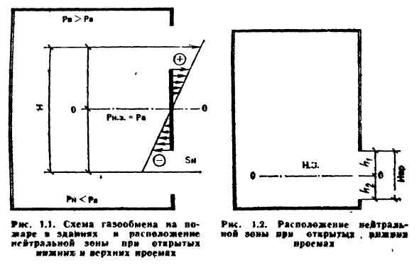

# 1.1. Основные понятия и определения

Пожаром называется неконтролируемое горение вне специального очага, наносящее материальный ущерб. Продолжительность по­жара, время воздействия теплоты на окружающую среду, а также материальный ущерб зависят от характера и величины пожарной нагрузки $$m_{ПН}$$ — массы горючих и трудногорючих материалов, в том числе конструктивных элементов, отнесенной к площади пола поме­щения или площади, занимаемой этими материалами в открытом пространстве \($$кг/м^2$$\).

Пространство, в котором развивается пожар, условно подразделяется на три зоны: горения, теплового воздействия и задымления.

Зоной горения называется часть пространства, в котором проте­кают процессы термического разложения или испарения горючих ве­ществ и материалов \(твердых, жидких, газов, паров\) в объеме диф­фузионного факела пламени. Данная зона может ограничиваться ограждениями здания \(сооружения\), стенками технологических установок, аппаратов, резервуаров.

Зона теплового воздействия примыкает к границам зоны горе­ния. В этой части пространства протекают процессы теплообмена между поверхностью пламени, окружающими строительными конструкциями и горючими материалами. Передача теплоты в окружающую среду осуществляется тремя способами: конвекцией, излучением, теплопроводностью. Границы зоны проходят там, где тепловое воз­действие приводит к заметному изменению состояния материалов, конструкций и создает невозможные условия для пребывания людей без противотепловой защиты.

Зоной задымления называется часть пространства, примыкаю­щая к зоне горения и заполненная дымовыми газами в концентра­циях, создающих угрозу для жизни и здоровья людей или затрудняющих действия пожарных подразделений. При пожарах в зданиях и на открытых пространствах зоны задымления имеют характер­ные особенности и зависят от различных факторов. Зона задымления может включать в себя всю зону теплового воздействия и значительно превышать ее. Внешними границами зоны задымления считаются места, где плотность дыма составляет 0,0001...0,0006 $$кг/м^3$$ , видимость предметов 6...12 м, концентрация кислорода в дыме не менее 16% и токсичность газов не представляет опасности для лю­дей, находящихся без средств противодымной защиты.

В процессе развития пожара различают три характерные фазы. В первой фазе горением охватывается до 80 % пожарной нагрузки.

Во второй фазе происходит активное пламенное горение с потерей массы пожарной нагрузки, скорость выгорания непрерывно увеличивается и достигает максимальных величин. В третьей фазе скорость выгорания резко падает, процесс характеризуется догоранием тлею­щих материалов и конструкций.

В каждом конкретном случае процесс развития пожара протека­ет при определенных условиях сосредоточения или рассредоточения пожарной нагрузки и газообмена, т.е. притока воздуха в зону го­рения и удаления из нее нагретых продуктов сгорания, а также ды­мовых газов.

Газовый обмен является постоянным явлением любого пожара. При пожарах на открытом пространстве газообмен характеризуется наличием восходящего столба или движущейся колонны газообразных продуктов сгорания. При пожарах в ограждениях \(зданиях\) газообмен зависит от наличия, состояния и площади проемов, высоты их расположения, удельной пожарной нагрузки и других факторов. Наиболее интенсивно газообмен протекает при наружных пожарах, пожарах в производственных зданиях со световыми фонарями, бесфонарных зданиях с дымоудаляющими люками в покрытиях, в сценической части и зрительном зале театрально-зрелищных учреждений, зданиях повышенной этажности, особенно административного и гостиничного назначения. Мощные потоки газов, особенно при наружных пожарах, пере­носят искры, горящие угли и головни на значительные расстояния, создавая условия для возникновения новых очагов горения, что следует учитывать при организации боевых действий подразделений пожарной охраны.

При газообмене в зданиях, когда доступ свежего воздуха к зоне горения сокращается, происходит обильное выделение продуктов неполного сгорания и теплового разложения. Указанные обстоятельства осложняют обстановку, создают наибольшую опасность для жизни людей и затрудняют оперативные действия подразделений по тушению пожара.

 При пожарах в зданиях в условиях газообмена образуются три зоны с различными давлениями: нижняя, верхняя и нейтральная \(рис. 1.1\). В нижней зоне \(части здания или помещения\) давление продуктов сгорания меньше, а в верхней больше давления наруж¬ного воздуха. На определенной высоте давление внутри помещения равно атмосферному, т. е. перепад давлений равен 0. Условная плоскость, на уровне которой давление равно атмосферному \(плоскость 0-0 на рис. 1.1 и 1.2\) называется плоскостью равных давлений или нейтральной зоной \(см. п. 1.3\).

